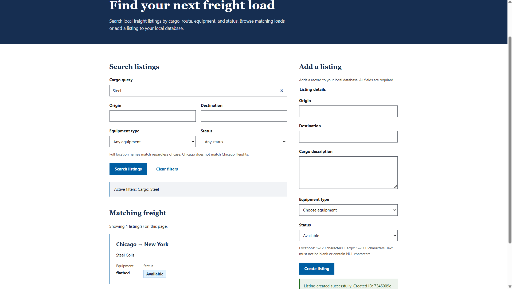

# Freight Search

A local freight-search portfolio project using Python 3.12 and the existing
project `.venv`. Implemented: database-independent liveness, PostgreSQL listing
create/get/full replacement, English full-text search with exact filters, and a
small local browser dashboard with search and listing creation. NATS, OpenSearch, and distributed indexing are planned extensions;
there are no production-scale or measured latency claims.

## Local setup

```bash
source .venv/bin/activate
cp .env.example .env  # only if .env does not already exist
```

Fill the empty password in `.env` with a strong local password from a password
generator. Keep credentials out of terminal output and database URLs.
Keep `.env` private and uncommitted. All five `POSTGRES_*` settings are required
by the API; Compose requires database, user, password, and port. The default
host port is 55432, published only on 127.0.0.1. Check that it is unused before
starting; select another unused port in `.env` if necessary.

Compose reads `.env` itself, but the host Python process needs exported variables.
Load your trusted local file in the shell before migration, API, or database tests:

```bash
set -a
source .env
set +a
docker compose up -d --wait postgres
PYTHONPATH=src python -m freight_search.migrate
```

The explicit migration is repeatable (creates missing tables/indexes); run it
again safely. It does not upgrade incompatible pre-existing tables. API startup
never modifies schema. Compose runs PostgreSQL only, using the verified official
`postgres:18.6-bookworm` image and a named volume at `/var/lib/postgresql`, the
PostgreSQL 18 image's documented mount path. `pg_isready` supplies the healthcheck.
Changing initialization credentials does not change users in an existing volume.
Do not delete the volume to restart the database.

Run locally:

```bash
python -m uvicorn freight_search.main:app --app-dir src --host 127.0.0.1 --port 8000
```



Open `http://127.0.0.1:8000/` for the local search interface after loading the
database settings and applying the schema as above. The page uses plain HTML,
CSS, and JavaScript with no external assets or build step. Its labeled controls
send relative requests to `/search` and `POST /listings`. The interface uses a white header, navy introduction, blue buttons, rectangular
controls, and generous spacing inspired by the [USWDS visual language](https://designsystem.digital.gov/).
It uses original freight content and no government branding or affiliation claims.
A visible label identifies it as a local portfolio demonstration. Search/Add listing
navigation, a skip-to-content link, and a repository footer organize the page. The page itself needs no database
configuration, but search and creation require the database.

The active-filter summary follows the search controls. Clear filters resets them
and browses from page 1. Previous/Next use `limit=20` and bounded offsets; changing
filters resets the page and cancels older searches. No total count is displayed.
Next is enabled after a full page, so the next page can be empty; Previous lets
you return. Concurrent writes can shift offset-based pages.

The create form requires origin, destination, cargo_description, equipment_type,
and status with the API's text limits and enums. It blocks duplicate submissions
while pending, preserves entries on failure, and shows the created UUID on success.
It then refreshes search from page 1 using the current filters. A created listing
may not match those filters. A lost response can leave creation unconfirmed even
if the server saved it; check search before retrying.

Manual browser checks (these are separate from the HTML response test):

- Submit with blank filters and with cargo, mixed-case route, equipment, and
  status filters. Compare returned records with `/search` and verify stored spelling.
- Create a clearly labeled fictional local listing. Check required fields,
  whitespace-only text, text limits, equipment/status choices, the success message,
  and created ID. Retrieve that ID through `GET /listings/{id}`. During a slow
  request, verify repeated clicks/Enter cannot submit again. On validation/server
  failure, verify entries remain available for correction or retry.
- With more than 20 local records, move Next and Previous, compare `limit`/`offset`
  requests, and confirm no total is implied. On a full final page, Next may be empty.
  Change a filter or use Clear filters and verify the page resets to 1.
- Check loading feedback, a route with no results, and an error when the API or
  database is unavailable. Submit different searches rapidly; the final results
  must belong to the most recent submission.
- Use Tab to reveal the skip-to-content link and Enter to move to the main content.
  Check Search/Add listing navigation and the repository footer link.
  Use Tab and Enter to operate every control. Check focus visibility, readable
  text, and single-column layout at a narrow mobile viewport as well as desktop.
- If a listing contains HTML-looking text, verify it appears literally rather
  than rendering markup. Listing values are assigned through `textContent`.

The database-independent TestClient test checks that `/` returns HTML with the
expected labeled search/create controls, constraints, and pagination controls,
even from a different working directory. It does not
execute JavaScript or verify visual layout; the browser checks above remain necessary.
Accessibility compliance has not been verified for this implementation.

## API and data flow

- `GET /health/live` returns HTTP 200 and `{"status": "ok"}`. Liveness does not
  prove PostgreSQL, NATS, or OpenSearch health and needs no database configuration.
- `POST /listings` accepts origin, destination, cargo_description, equipment_type,
  and status; returns 201 and the persisted record.
- `GET /listings/{id}` returns a record or 404.
- `PUT /listings/{id}` requires all editable fields, preserves id/created_at,
  updates updated_at, and returns the record or 404.
- `GET /search` returns `{"items": [...]}`. Optional `q` is at most 200 characters;
  blank/missing q browses records. Origin/destination filters are case-insensitive
  exact matches: `chicago` matches `Chicago`, but not `Chicago Heights`.
  Stored location spelling is preserved. Equipment is dry_van, refrigerated, or flatbed; status is available,
  booked, or delivered. Limit is 1–100 (default 20); offset is 0–10000 (default 0).

For a fictional available dry_van listing from Chicago to Dallas carrying copper,
combine the route with cargo text, equipment, status, and pagination:

```text
GET /search?origin=chicago&destination=DALLAS&equipment_type=dry_van&status=available&q=copper&limit=20&offset=0
```

The response is `{"items": [...]}` with the stored spelling. A full replacement
via `PUT /listings/{id}` setting `status` to `booked` removes the listing from
this available search; `GET /listings/{id}` still retrieves it.

Pydantic validates nonblank input and length limits (120 characters for locations,
2000 for descriptions). PostgreSQL also enforces critical constraints. Writes
use parameterized SQL in transactions. PostgreSQL regenerates the stored English
`tsvector` from cargo_description on insert/update; its GIN index supports text
matching. Search uses `websearch_to_tsquery('english', ...)` and ranks by `ts_rank`,
then created_at descending and UUID ascending for deterministic ties. Browsing
uses the same timestamp/UUID order. Pagination is offset-based, not a snapshot.

Synchronous FastAPI handlers run synchronous Psycopg calls in worker threads.
One connection per database request keeps this small MVP simple; no pool or async
rewrite is included. Connections have a 5-second connect timeout, 5-second query
limit, 2-second lock limit, and 10-second idle transaction limit. Database errors
produce generic 503 responses without credentials or database error details.

## Tests

```bash
python -m pytest -q
python -m pytest -q tests/test_health.py -W error
RUN_DB_TESTS=1 python -m pytest -q -W error
```

Without `RUN_DB_TESTS=1`, integration tests report skips. Opted-in tests require
the exported local database configuration and a healthy database. Each test
creates a uniquely named temporary schema, applies the actual schema, and overrides
only the connection dependency to select that real schema. Fixtures are fictional
and live only in test code. Cleanup drops only that test-created schema; application
tables are never truncated. TestClient sends in-process HTTP requests through
FastAPI routing and runs lifecycle hooks through its context manager.

Restart without deleting persistent data using `docker compose restart postgres`,
then wait for its healthcheck. A restart persistence check should insert a uniquely
identified test-owned listing, verify that same record after restart, and delete
only that UUID afterward. `docker compose stop` stops the local service while
retaining the named volume.

Official references: [image tags](https://github.com/docker-library/official-images/blob/master/library/postgres),
[image volume guidance](https://hub.docker.com/_/postgres),
[PostgreSQL search](https://www.postgresql.org/docs/18/textsearch-tables.html),
[search queries and ranking](https://www.postgresql.org/docs/18/textsearch-controls.html),
[Psycopg parameters](https://www.psycopg.org/psycopg3/docs/basic/params.html).

## GitHub Actions CI

`.github/workflows/ci.yml` runs on pushes to `main`, pull requests, and manual
`workflow_dispatch` requests. It uses Ubuntu 24.04 and Python 3.12 with a
10-minute job timeout. Official checkout/setup-python actions are pinned to
verified full commit SHAs with release-version comments; token permissions are
limited to `contents: read` and checkout does not persist credentials.

CI starts an ephemeral `postgres:18.6-bookworm` service with a `pg_isready`
healthcheck and loopback port mapping. The clearly labeled CI-only credentials
are scoped to that disposable service. The workflow neither reads nor uploads
local `.env`, requires no production secrets, and performs no deployment.

It installs `requirements.lock` using `python -m pip install --require-hashes
-r requirements.lock`, runs `python -m pip --no-cache-dir check`, applies
`PYTHONPATH=src python -m freight_search.migrate` twice, and runs
`RUN_DB_TESTS=1 python -m pytest -q -W error`. Integration tests retain their
dedicated temporary-schema isolation.

Once the workflow is on GitHub, view **Actions → PostgreSQL tests** for run logs
or select **Run workflow** when the workflow is present on the default branch.
Local validation does not establish a passing GitHub run; runner setup, service
startup, and clean locked dependency installation require actual GitHub execution.
